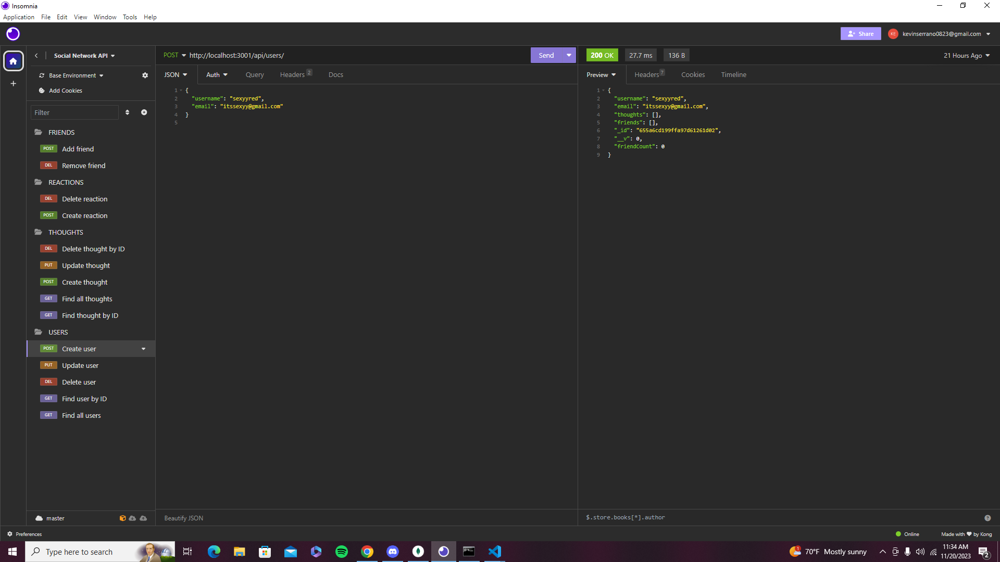

# Social-Network-API

## Description

 The Social Network API is a Node.js application programming interface (API) enabling users to execute CRUD operations on data models related to social networking. These models, encompassing friends, users, thoughts, and reactions, can be retrieved either by ID or collectively. Constructed with Node.js and Mongoose, the API offers a straightforward and scalable approach to managing social networking data, free from the constraints of conventional relational databases.

# Overview 

## The Challenge:

 The Challenge is to build an API for a social network web application where users can share their thoughts, react to friends’ thoughts, and create a friend list. You’ll use Express.js for routing, a MongoDB database, and the Mongoose ODM. In addition to using the Express.js and Mongoose packages, you may also optionally use a JavaScript date library of your choice or the native JavaScript Date object to format timestamps.

## Usage

 Link to walkthrough video: https://youtu.be/zQlnZdZTvWs?si=gR4zUKhHwKEvhu3f

 

## Contribution
 Follow me on Github at [felipeokay](https://github.com/felipeokay) 

 For any questions please contact me via email at: Kevinserrano0823@gmail.com